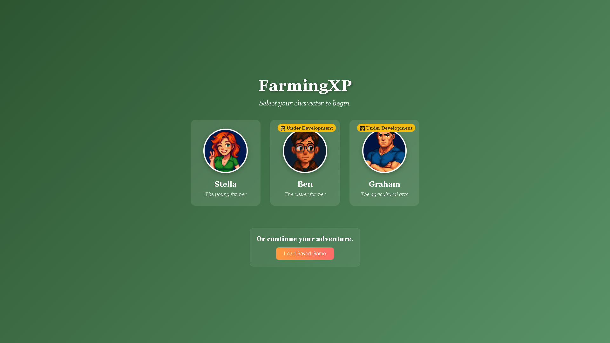
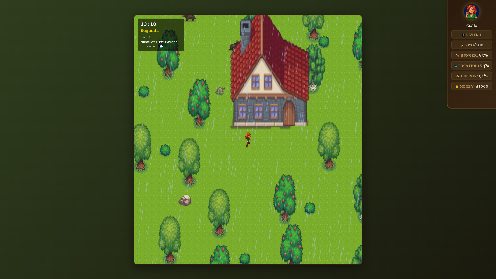
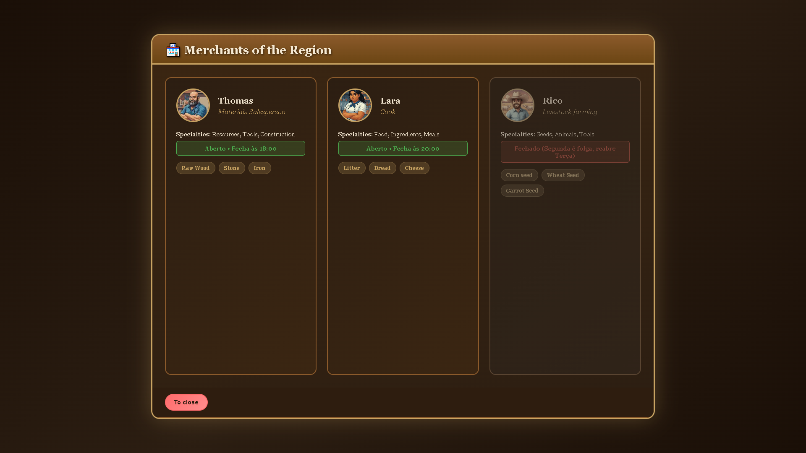

# FarmXP Browser

**PT-BR:** Um jogo de simulação de fazenda que roda inteiramente no navegador, construído com JavaScript puro e HTML5 Canvas.

**EN:** A farming simulation game that runs entirely in the browser, built with vanilla JavaScript and HTML5 Canvas.

---

## Screenshots

<p align="center">
  
  
  
</p>

---

## A História / The Story

**PT-BR:**
> Após o falecimento do vovô, o legítimo dono do terreno da fazenda, a vovó decide escolher um dos seus netos para herdar o terreno e cuidar da terra tão preciosa. Jogue na pele de um dos três primos e prove que você é digno de continuar o legado da família!

**EN:**
> After grandfather's passing, the rightful owner of the farm, grandmother decides to choose one of her grandchildren to inherit the land and care for this precious earth. Play as one of three cousins and prove you're worthy of continuing the family legacy!

---

## Personagens / Characters

| Personagem | Descrição | Description |
|------------|-----------|-------------|
| **Stella** | A forte fazendeira, aventureira e corajosa. Sempre pronta para qualquer desafio. | The strong farmer, adventurous and brave. Always ready for any challenge. |
| **Ben** | O esperto e jovem técnico. Inteligente e ágil, resolve problemas com criatividade. | The smart young technician. Intelligent and agile, solves problems creatively. |
| **Graham** | O grandão, homem sério e protetor. O melhor para trabalho pesado no campo. | The big guy, serious and protective. Best suited for heavy fieldwork. |

---

## Características / Features

**PT-BR:**
- Seleção e customização de personagem
- Mecânicas de agricultura (plantar, regar, colher)
- Sistema de construção (cercas, baús, poços)
- Sistema de comércio com mercadores
- Criação de animais com IA autônoma
- Clima dinâmico e ciclo dia/noite
- Sistema de necessidades (fome, sede, energia)
- Suporte para desktop e mobile

**EN:**
- Character selection and customization
- Farming mechanics (planting, watering, harvesting)
- Building system (fences, chests, wells)
- Merchant commerce system with schedules
- Animal husbandry with autonomous AI
- Dynamic weather and day/night cycle
- Player needs system (hunger, thirst, energy)
- Desktop and mobile support

---

## Controles / Controls

### Movimento / Movement

| Tecla / Key | Ação / Action |
|-------------|---------------|
| `WASD` ou `← → ↑ ↓` | Mover / Move |

### Interação / Interaction

| Tecla / Key | PT-BR | EN |
|-------------|-------|-----|
| `E` | Interagir com objetos | Interact with objects |
| `I` | Abrir inventário | Open inventory |
| `U` | Abrir mercadores principais | Open main merchants |
| `O` | Abrir configurações | Open settings |
| `B` | Entrar no modo construção | Enter build mode |
| `ESC` | Fechar menu / Cancelar | Close menu / Cancel |
| `Space` | Ação primária | Primary action |

### Modo Construção / Build Mode

| Tecla / Key | PT-BR | EN |
|-------------|-------|-----|
| `R` | Rotacionar objeto | Rotate object |
| `T` | Posicionar objeto | Place object |
| `1-3` | Ajustar posição horizontal na grade | Adjust horizontal grid position |
| `4-6` | Ajustar posição vertical na grade | Adjust vertical grid position |
| `ESC` | Cancelar modo construção | Cancel build mode |

### Controles Mobile / Mobile Controls

**PT-BR:**
- **Joystick Virtual** - Mover o personagem
- **Toque** - Interagir com objetos
- **Botões UI** - Acessar menus

**EN:**
- **Virtual Joystick** - Move player
- **Tap** - Interact with objects
- **UI Buttons** - Access menus

Veja [docs/CONTROLS.md](./docs/CONTROLS.md) para controles completos. / See [docs/CONTROLS.md](./docs/CONTROLS.md) for complete controls.

---

## Sistemas do Jogo / Game Systems

### Necessidades do Jogador / Player Needs

**PT-BR:**
O jogador possui três necessidades para gerenciar:
- **Fome** - Coma alimentos para restaurar
- **Sede** - Beba água para restaurar
- **Energia** - Durma para restaurar

⚠️ **Aviso:** Não é bom ficar acordado muitos dias seguidos... Cuide de si!

**EN:**
The player has three needs to manage:
- **Hunger** - Eat food to restore
- **Thirst** - Drink water to restore
- **Energy** - Sleep to restore

⚠️ **Warning:** Staying awake for many consecutive days has consequences... Take care of yourself!

### Sistema de Animais / Animal System

**PT-BR:**
- Cuide da saúde dos seus animais
- Leve ao veterinário para diagnóstico
- Venda-os, divirta-os, cuide deles!
- Animais com IA autônoma e comportamentos realistas

**EN:**
- Care for your animals' health
- Take them to the vet for diagnosis
- Sell them, entertain them, care for them!
- Animals with autonomous AI and realistic behaviors

### Agricultura / Farming

**PT-BR:**
- Plante sementes e veja sua plantação crescer
- Regue suas plantas e cuide delas
- Colha os frutos do seu trabalho
- Gere alimentos e lucros para si
- Abasteça as cidades ao seu redor

**EN:**
- Plant seeds and watch your crops grow
- Water your plants and care for them
- Harvest the fruits of your labor
- Generate food and profits for yourself
- Supply the surrounding cities

### Clima / Weather

**PT-BR:**
- Sistema dinâmico de clima (sol, chuva, tempestade, neblina, nevasca)
- Ciclo dia/noite (2 minutos reais = 1 dia no jogo)
- Mudanças sazonais afetam as probabilidades de clima

**EN:**
- Dynamic weather system (clear, rain, storm, fog, blizzard)
- Day/night cycle (2 real minutes = 1 game day)
- Seasonal changes affect weather probabilities

### Inventário / Inventory

**PT-BR:**
Itens organizados por categorias:
- Ferramentas (10 slots)
- Sementes (20 slots)
- Construção (20 slots)
- Comida para Animais (15 slots)
- Alimentos (15 slots)
- Recursos (30 slots)

**EN:**
Items organized by categories:
- Tools (10 slots)
- Seeds (20 slots)
- Construction (20 slots)
- Animal Food (15 slots)
- Food (15 slots)
- Resources (30 slots)

---

## Começando / Getting Started

### Pré-requisitos / Prerequisites

- [Bun](https://bun.sh/) v1.2.21 ou superior / or higher

### Instalação / Installation

```bash
# Clonar o repositório / Clone the repository
git clone https://github.com/Gabriel-Andraade/FarmXP_Browser.git
cd FarmXP_Browser

# Instalar dependências / Install dependencies
bun install
```

### Executando / Running

```bash
# Modo desenvolvimento / Development mode
bun run dev

# Modo produção / Production mode
bun run start
```

Abra / Open <http://localhost:3000> no seu navegador / in your browser.

---

## Estrutura do Projeto / Project Structure

```text
FarmXP_Browser/
├── index.html          # Ponto de entrada / Main entry point
├── server.ts           # Servidor de desenvolvimento Bun / Bun dev server
├── style/              # Módulos CSS / CSS modules
├── assets/             # Sprites e imagens / Sprites and images
├── public/assets/      # Assets públicos / Public assets
├── scripts/            # Módulos JavaScript / JavaScript modules
│   ├── main.js         # Loop do jogo / Game loop
│   ├── theWorld.js     # Renderização do mundo / World rendering
│   ├── collisionSystem.js  # Sistema de colisão / Collision system
│   ├── thePlayer/      # Sistemas do jogador / Player systems
│   │   ├── playerSystem.js
│   │   ├── inventorySystem.js
│   │   └── ...
│   ├── animal/         # IA dos animais / Animal AI
│   └── ...
└── docs/               # Documentação / Documentation
```

---

## Documentação / Documentation

Veja a pasta [docs/](./docs/) para documentação detalhada: / See the [docs/](./docs/) folder for detailed documentation:

- [Guia de Setup / Setup Guide](./docs/SETUP.md)
- [Arquitetura / Architecture](./docs/ARCHITECTURE.md)
- [Controles / Controls](./docs/CONTROLS.md)
- [Sistemas do Jogo / Game Systems](./docs/SYSTEMS.md)
- [Referência da API / API Reference](./docs/API.md)
- [Contribuindo / Contributing](./docs/CONTRIBUTING.md)

---

## Contribuindo / Contributing

**PT-BR:**
Contribuições são bem-vindas! Por favor, leia nosso [Guia de Contribuição](./docs/CONTRIBUTING.md) primeiro.

**EN:**
Contributions are welcome! Please read our [Contributing Guide](./docs/CONTRIBUTING.md) first.

1. Fork o repositório / Fork the repository
2. Crie uma branch (`git checkout -b feature/nova-feature`)
3. Commit suas mudanças (`git commit -m 'Adiciona nova feature'`)
4. Push para a branch (`git push origin feature/nova-feature`)
5. Abra um Pull Request / Open a Pull Request

---

## Idioma / Language

**PT-BR:** A interface do jogo está em Português Brasileiro, com opção de alterar para Inglês ou Espanhol nas configurações.

**EN:** The game interface is in Brazilian Portuguese, with the option to change to English or Spanish in the settings.

---

## Suporte de Navegadores / Browser Support

Chrome 90+, Firefox 88+, Safari 14+, e navegadores mobile com suporte a toque / and mobile browsers with touch support.

---

## Tech Stack

- **Runtime**: [Bun](https://bun.sh)
- **Graphics**: HTML5 Canvas
- **Language**: JavaScript (ES Modules)
- **Styling**: CSS3

---

## Licença / License

Este projeto está licenciado sob a Licença ISC - veja o `package.json` para detalhes.

This project is licensed under the ISC License - see the `package.json` for details.

---

<p align="center">
  Feito com ❤️ por / Made with ❤️ by Gabriel Andrade
</p>
